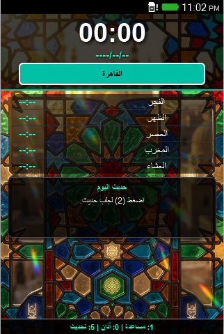

# 🌙 Simple Azan and Azkar for KaiOS

A lightweight, feature-rich Islamic application specifically designed for KaiOS and low-resource web environments. [cite_start]This app provides accurate prayer timings for Egyptian governorates, Hijri dates, and daily Hadiths with an immersive, high-contrast UI optimized for small screens. [cite: 1]

---

### ✨ Key Features

* [cite_start]**Real-time Prayer Timings**: Automatically fetches accurate prayer times using the Aladhan API. [cite: 1]
* [cite_start]**Egyptian Cities Support**: Built-in support for 27 Egyptian governorates, including Cairo, Giza, and Alexandria. [cite: 1]
* [cite_start]**Hijri Calendar**: Displays the current Hijri date alongside the digital clock. [cite: 1]
* [cite_start]**Hadith Encyclopedia**: Fetches random Sahih Hadiths from the HadeethEnc API. [cite: 1]
* **Smart Alerts**:
    * [cite_start]**Audio**: Full Adhan audio playback (`adhan.mp3`) at prayer times. [cite: 1]
    * [cite_start]**Notifications**: System-level notifications for upcoming prayers. [cite: 1]
    * [cite_start]**Vibration**: Haptic feedback alerts for supported devices. [cite: 1]
* [cite_start]**Persistence**: Saves city preferences and cached data for offline viewing using `localStorage`. [cite: 1]

---

### ⌨️ Controls & Navigation

[cite_start]The app is optimized for physical keyboard and D-pad navigation: [cite: 1]

| Key | Action |
| :--- | :--- |
| **(1)** | Open/Close User Guide (Help) |
| **(0)** | Test Adhan Sound & Vibration |
| **(2)** | Generate a new Random Hadith |
| **(5)** | Refresh Prayer Times (Manual Sync) |
| **(◀ / ▶)** | Open Governorate Selection Menu |
| **(▲ / ▼)** | Navigate through menus or UI focus |
| **(Enter)** | Confirm selection or update data |

---

### 🛠️ Technical Overview

* [cite_start]**Architecture**: Built with HTML5, CSS3, and Vanilla JavaScript. [cite: 1]
* **External APIs**:
    * [cite_start]`Aladhan API`: For prayer timings. [cite: 1]
    * [cite_start]`HadeethEnc API`: For the Hadith database. [cite: 1]
* **Platform Support**: Configured as a "privileged" app in `manifest.webapp` to allow access to `systemXHR`, `vibration`, and the `audio-channel-alarm` required for KaiOS.

---

### 🚀 Setup & Installation

1.  **Clone the Repository**: 
    ```bash
    git clone [https://github.com/mahmoudyosrimahmoud13/simple-azan-and-azkar-for-kaios.git](https://github.com/mahmoudyosrimahmoud13/simple-azan-and-azkar-for-kaios.git)
    ```
2.  [cite_start]**Add Assets**: Ensure you have an `adhan.mp3` file in the root directory for the audio alerts to work. [cite: 1]
3.  **Run**: Open `index.html` in any modern web browser or load it onto a KaiOS device via the WebIDE.
4.  **Permissions**: Ensure you allow **Notifications** and **Audio** playback in your device settings for the alerts to function.

---

### 🖼️ Preview



*The interface features a beautiful Islamic geometric background with high-contrast text for easy readability on small and large screens alike.*
